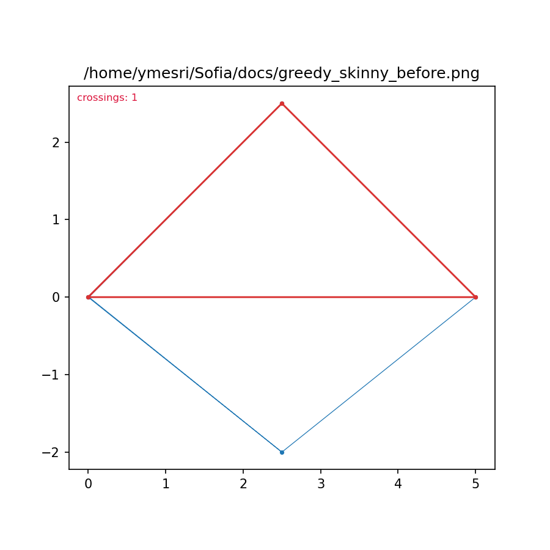
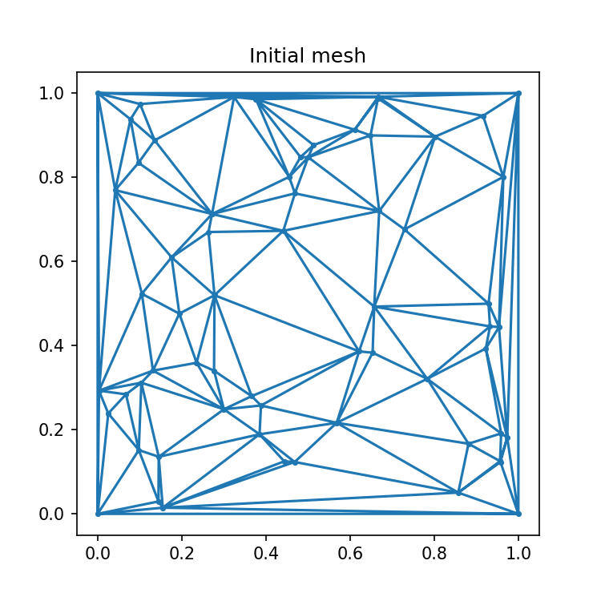
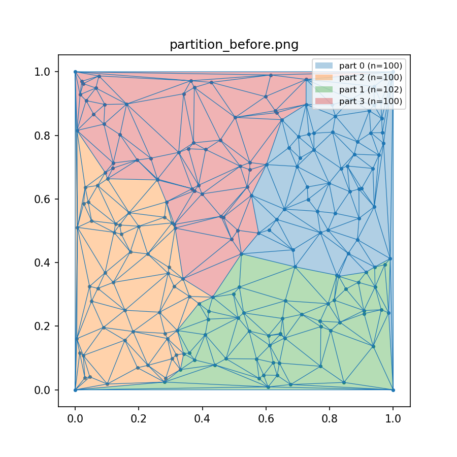
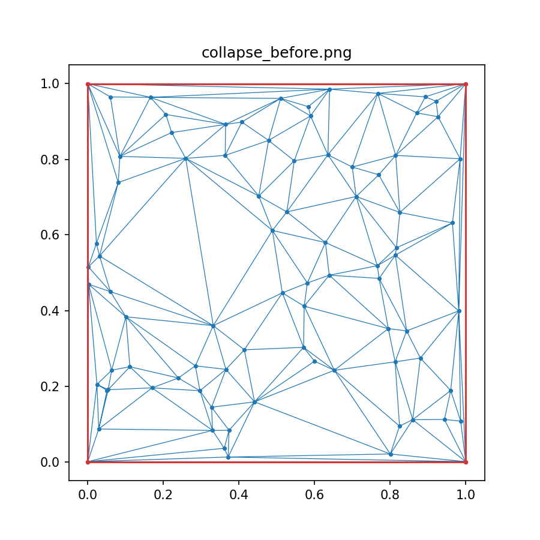
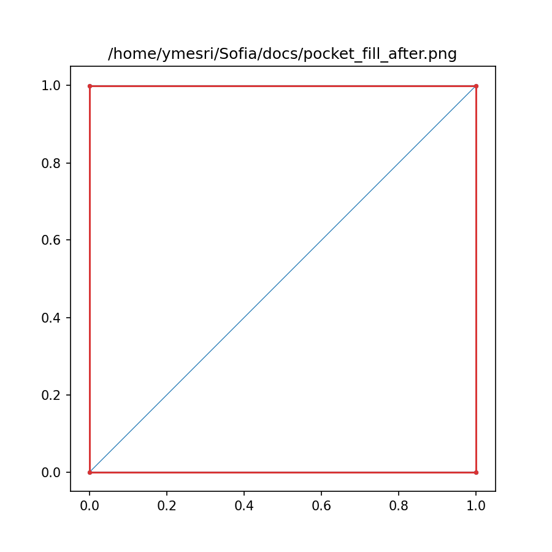
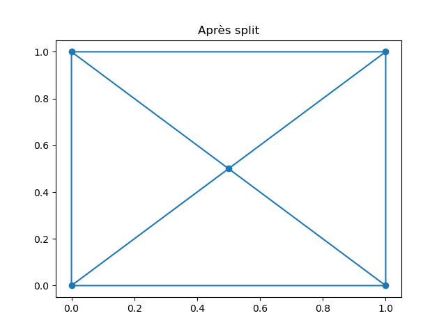
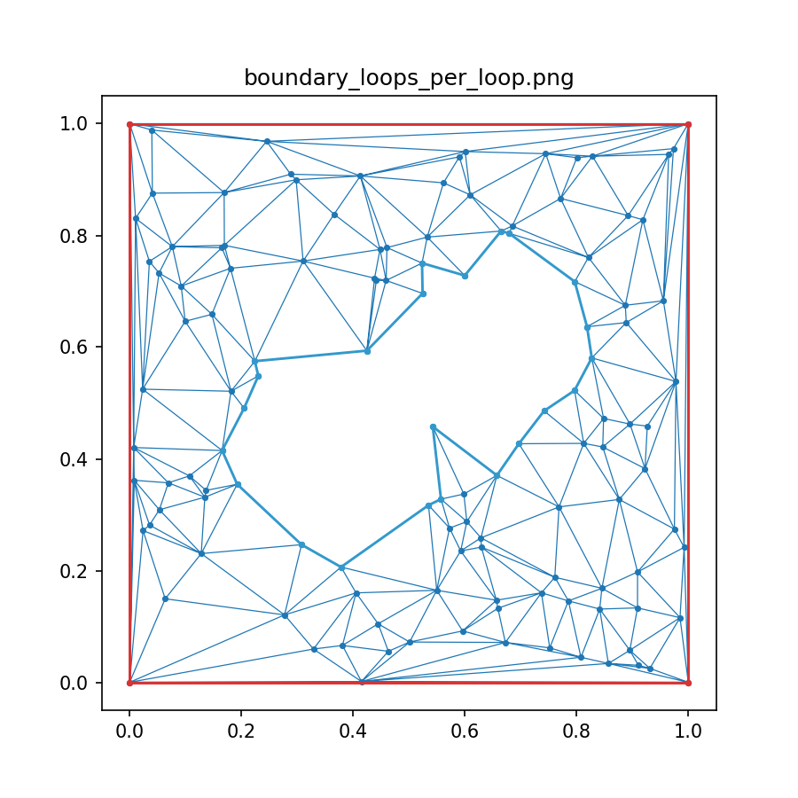
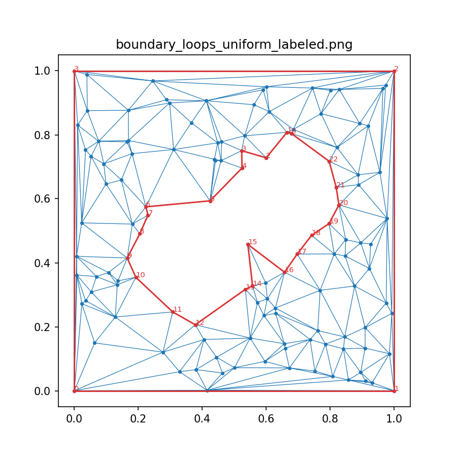
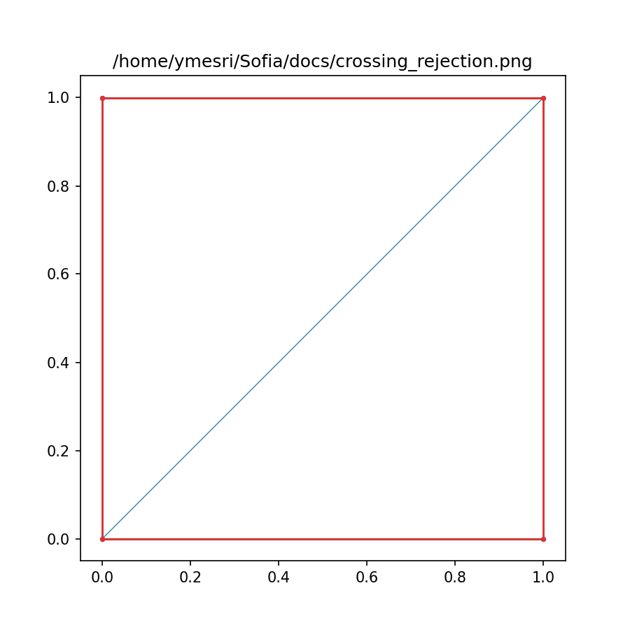

# Sofia: Patch-based 2D Mesh Editor and Remesher

[](https://github.com/youssef-mesri/sofia/actions/workflows/ci.yml)

## Table of contents

- [Install](#install)
- [Quick start](#quick-start)
- [Gallery](#gallery)
- [Reproduce](#reproduce)

Sofia is a fast, patch-based mesh editing and remeshing toolkit for 2D triangular meshes. It focuses on high-quality local operations (split, collapse, flip, fill pockets) with robust conformity checks and optional strict-mode simulations.

## Features

- Patch-based editor with amortized conformity checks and optional strict mode
- Local operations: split edges (midpoint/Delaunay), edge collapse, edge flip, add/remove nodes, pocket fill
- Mesh quality utilities: min-angle, angles/areas, non-worsening checks
- Spatial pruning for crossing-edge detection, tombstone-aware compaction
- Greedy remesh driver and patch driver for batch processing
- Tests via pytest and headless rendering via Matplotlib Agg

## Install

Requires Python 3.8+.

Optional but recommended to use a virtual environment:

```bash
python -m venv .venv
source .venv/bin/activate
pip install -U pip
pip install -r requirements.txt
```

## Quick start

```python
from sofia.sofia.mesh_modifier2 import build_random_delaunay, PatchBasedMeshEditor

pts, tris = build_random_delaunay(npts=200, seed=0)
editor = PatchBasedMeshEditor(pts.copy(), tris.copy(), debug=False)

# Run a simple operation
edge = tuple(sorted((0, 1)))
ok = editor.flip_edge(edge)
print('flip ok:', ok)

# Check quality
from sofia.sofia.quality import mesh_min_angle
print('min angle:', mesh_min_angle(editor.points, editor.triangles))
```

## Gallery

This gallery illustrates typical operations and drivers: improvements before/after (greedy, collapse, pocket fill), patch batching, and strict-mode guards.

<table>
  <tr>
    <td align="center">
      
      <br/><sub>Greedy skinny (before)</sub>
    </td>
    <td align="center">
      
      <br/><sub>Greedy skinny (after)</sub>
    </td>
    <td align="center">
      
      <br/><sub>Patch batches</sub>
    </td>
  </tr>
  <tr>
    <td align="center">
      
      <br/><sub>Strict mode (before)</sub>
    </td>
    <td align="center">
      
      <br/><sub>Strict mode (after)</sub>
    </td>
    <td align="center">
      
      <br/><sub>Patch partition (before)</sub>
    </td>
  </tr>
  <tr>
    <td align="center">
      
      <br/><sub>Patch partition (after)</sub>
    </td>
    <td align="center">
      
      <br/><sub>Edge collapse (before)</sub>
    </td>
    <td align="center">
      
      <br/><sub>Edge collapse (after)</sub>
    </td>
  </tr>
  <tr>
    <td align="center">
      
      <br/><sub>Pocket fill (before)</sub>
    </td>
    <td align="center">
      
      <br/><sub>Pocket fill (after)</sub>
    </td>
    <td align="center">
      
      <br/><sub>Split edge (test)</sub>
    </td>
  </tr>
</table>

## Reproduce

You can generate similar snapshots using the bundled demos and scripts:

- Patch batches: see `demos/patch_batches.py`
- Edge collapse (before/after): see `demos/edge_collapse_demo.py`
- Greedy improvement scenarios: see `demos/mesh_editor_demos.py` and `demos/refinement_scenario.py`
- Pocket fill (before/after): see `utilities/patch_fill_check.py`
- Patch partitioning: see `demos/partition_parallel.py`
- Strict-mode checks and boundary visuals: see `scripts/generate_boundary_screenshots.py`

Run them as standard Python scripts, for example:

```bash
python demos/patch_batches.py
python demos/edge_collapse_demo.py
python utilities/patch_fill_check.py
```

## Tests

```bash
pytest -q
```

## Repository layout

- `sofia/sofia/` core library modules (editor, geometry, quality, drivers, helpers, etc.)
- `sofia/tests/` unit tests
- `demos/` and `utilities/` optional scripts

## License

MIT. See `LICENSE`.

## Acknowledgements

Includes vectorized geometry kernels and robust simulation checks to keep meshes conformal during local edits.Sofia Mesh Remeshing Toolkit
============================

High-level description (to expand): Greedy and patch-based 2D triangle mesh quality improvement with pocket filling, strict conformity checks, visualization, and GIF instrumentation.

Key Features
------------
- Greedy vertex/edge improvement with rollback-safe strict mode.
- Patch / batch driver with configurable acceptance policy and optional greedy subpasses.
- Pocket detection and (optional/forced) pocket filling strategies (quad, Steiner fan, earclip).
- Operation rejection diagnostics + JSON logging.
- Visualization overlays (boundary loops, edge crossings) and animated GIF capture in both modes.

Quickstart
----------

Install (editable dev mode):
```bash
pip install -e .[dev]
```

CLI usage (installed console script):
```bash
sofia-remesh greedy --npts 80 --gif-out run.gif
sofia-remesh patch --npts 120 --threshold 20 --gif-out patch.gif
```

Or directly via module (without installing console script):
```bash
python -m sofia.sofia.remesh_driver greedy --npts 80
```

Python API example:
```python
from sofia import greedy_remesh
pts, tris = greedy_remesh(npts=80)
```

Configuration & Unified Config Objects
--------------------------------------
Greedy and patch drivers now share a unified configuration layer. Prefer constructing a `GreedyConfig` or `PatchDriverConfig` (alias of `PatchConfig`) and optionally wrapping them in a `RemeshConfig`:

```python
from sofia import greedy_remesh, PatchDriverConfig, RemeshConfig
from sofia.sofia.config import GreedyConfig  # or import GreedyConfig from sofia.sofia.config directly
from sofia.sofia.mesh_modifier2 import build_random_delaunay, PatchBasedMeshEditor

pts, tris = build_random_delaunay(npts=60, seed=0)
editor = PatchBasedMeshEditor(pts, tris)

g_cfg = GreedyConfig(max_vertex_passes=2, max_edge_passes=1, strict=True, reject_crossings=True)
greedy_remesh(editor, config=g_cfg)

patch_cfg = PatchDriverConfig(threshold=15.0, use_greedy_remesh=True, greedy_vertex_passes=1, greedy_edge_passes=1)
remesh_cfg = RemeshConfig.from_patch_config(patch_cfg)
# (pass remesh_cfg to patch driver via run_patch_batch_driver if calling directly)
```

CLI Config Dump for Reproducibility
-----------------------------------
You can emit the effective configuration as JSON (without running) to capture experiment settings:

CLI: Load Config From JSON
--------------------------
Both modes accept a JSON configuration via `--config-json`. The JSON can be either:
- the direct config object (flat dict of fields), or
- the output of `config-dump` (an object with `{"type": "greedy|patch", "config": { ... }}`).

Examples:

Greedy from JSON
```bash
sofia-remesh greedy --npts 60 --seed 1 --config-json greedy_cfg.json --no-plot

# greedy_cfg.json (either form is accepted)
{
  "type": "greedy",
  "config": {
    "max_vertex_passes": 2,
    "max_edge_passes": 1,
    "strict": false,
    "reject_crossings": true,
    "gif_capture": false
  }
}
```

Patch from JSON
```bash
sofia-remesh patch --npts 80 --seed 0 --config-json patch_cfg.json --no-plot

# patch_cfg.json (subset allowed; unspecified fields use CLI defaults)
{
  "config": {
    "threshold": 18.0,
    "max_iterations": 5,
    "top_k": 20,
    "use_greedy_remesh": true,
    "greedy_vertex_passes": 1,
    "greedy_edge_passes": 1
  }
}
```

Notes:
- Any fields omitted in the JSON fall back to the CLI flag values (or defaults).
- JSON produced by `sofia-remesh config-dump` can be fed back directly via `--config-json`.

```bash
sofia-remesh config-dump --mode greedy --vertex-passes 3 --edge-passes 2 --reject-crossings > greedy_cfg.json
sofia-remesh config-dump --mode patch --threshold 18 --top-k 40 --use-greedy-remesh > patch_cfg.json
```

Deprecation Notice
------------------
Calling `greedy_remesh` with positional / individual keyword parameters (without `config=`) now raises a `DeprecationWarning` and will be removed in a future minor release. Update code to:
```python
from sofia.sofia.config import GreedyConfig
greedy_remesh(editor, config=GreedyConfig(max_vertex_passes=2, max_edge_passes=2))
```

Current Package Layout
----------------------
```
sofia/
  __init__.py              # flat public API (lazy loads heavy modules)
  sofia/                   # internal implementation package
    remesh_driver.py       # CLI + greedy/patch orchestration
    patch_driver.py
    mesh_modifier2.py      # legacy editor (internal use)
    operations.py
    diagnostics.py
    visualization.py
    conformity.py
    geometry.py
    quality.py
    pocket_fill.py
    patch_batching.py
    stats.py
    triangulation.py
    helpers.py
  tests/                   # pytest suite (52 tests)
    test_*.py
  demos/
    ...                    # interactive / visualization demos
README.md
pyproject.toml
LICENSE
```

Backward Compatibility & Deprecations
-------------------------------------
Thin root-level shim modules (e.g. `mesh_modifier2.py`, `triangulation.py`) remain temporarily to avoid breaking older code; they emit `DeprecationWarning` advising imports from `sofia` instead. Plan: remove shims in a future 0.2 or 1.0 release. Prefer:
```python
from sofia import greedy_remesh, triangle_area
```
or for deep/internal APIs:
```python
from sofia.sofia.remesh_driver import greedy_remesh
```

Testing
-------
The pytest configuration (`pytest.ini`) points discovery at `sofia/tests`. Run the suite with:
```bash
pytest -q
```
Smoke test `test_import_sofia.py` ensures the top-level package imports cleanly and lazy loading is intact.

Roadmap
-------
- Publish to PyPI (`sofia-mesh`).
- Add CI (lint, type check, tests, coverage badge).
- Document pocket filling strategies and acceptance metrics.
- Provide performance benchmarks and larger mesh examples.

License
-------
See `LICENSE` file (placeholder MIT).

Visualization
-------------
The helper `plot_mesh` in `sofia/sofia/visualization.py` renders a compacted view of the current mesh and can overlay boundary loops and crossing summaries.

New options for boundary loops:
- loop_color_mode: 'per-loop' (default) colors each boundary loop differently, or 'uniform' uses a single color for all loops.
- loop_vertex_labels: True adds small numeric labels marking the order of vertices along each loop (useful for debugging boundary extraction correctness).

Example usage:
```python
from sofia.sofia.visualization import plot_mesh
plot_mesh(editor, outname="mesh_after.png", highlight_boundary_loops=True, loop_color_mode='uniform', loop_vertex_labels=True)
```

Example snapshots (compact gallery):

Boundary loop coloring modes

| Per-loop colors | Uniform with vertex indices |
| --- | --- |
|  |  |

Skinny triangle improvement (before/after)

| Before | After |
| --- | --- |
|  |  |

High-degree center (heptagon) removal (before/after)

| Before | After |
| --- | --- |
|  |  |

Pocket fill on empty quad (before/after)

| Before | After |
| --- | --- |
|  |  |

Crossing rejection demo

| Crossing rejection |
| --- |
|  |
